### Setup and Prepare Project Directory
Clone or set up the directory structure as follows:
```txt
VSDBabySoC/
├── src/
│   ├── include/
│   │   ├── sandpiper.vh
│   │   └── other header files...
│   ├── module/
│   │   ├── vsdbabysoc.v      # Top-level module integrating all components
│   │   ├── rvmyth.v          # RISC-V core module
│   │   ├── avsdpll.v         # PLL module
│   │   ├── avsddac.v         # DAC module
│   │   └── testbench.v       # Testbench for simulation
└── output/
└── compiled_tlv/         # Holds compiled intermediate files if needed
```
### 🛠️ Cloning the Project

To begin, clone the VSDBabySoC repository using the following command:

```bash


git clone https://github.com/manili/VSDBabySoC.git

cd ~/VSDBabySoC/

nagendrakudva123@nagendrakudva123-VirtualBox:~/VLSI$ ls VSDBabySoC/
images  LICENSE  Makefile  README.md  src

nagendrakudva123@nagendrakudva123-VirtualBox:~/VLSI$ ls VSDBabySoC/src/module/
avsddac.v  avsdpll.v  clk_gate.v  pseudo_rand_gen.sv  pseudo_rand.sv  rvmyth_gen.v  rvmyth.tlv  rvmyth.v  testbench.rvmyth.post-routing.v  testbench.v  vsdbabysoc.v
```
### TLV to Verilog Conversion for RVMYTH

Initially, you will see only the `rvmyth.tlv` file inside `src/module/`, since the RVMYTH core is written in TL-Verilog.

To convert it into a `.v` file for simulation, follow the steps below:

<strong>🔧 TLV to Verilog Conversion Steps</strong>

```bash
# Step 1: Install python3-venv (if not already installed)
sudo apt update
sudo apt install python3-venv python3-pip

# Step 2: Create and activate a virtual environment
cd ~/VSDBabySoC/
python3 -m venv sp_env
source sp_env/bin/activate

# Step 3: Install SandPiper-SaaS inside the virtual environment
pip install pyyaml click sandpiper-saas

# Step 4: Convert rvmyth.tlv to Verilog
sandpiper-saas -i ./src/module/*.tlv -o rvmyth.v --bestsv --noline -p verilog --outdir ./src/module/
```
 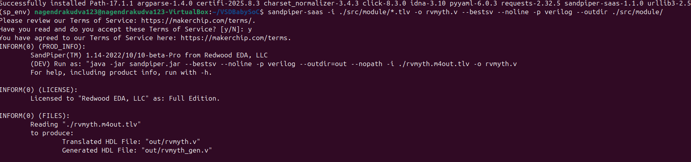

✅ After running the above command, rvmyth.v will be generated in the src/module/ directory.

You can confirm this by listing the files:

```bash
nagendrakudva123@nagendrakudva123-VirtualBox:~$ cd VLSI/VSDBabySoC/
nagendrakudva123@nagendrakudva123-VirtualBox:~/VSDBabySoC$ ls src/module/
avsddac.v  avsdpll.v  clk_gate.v  pseudo_rand_gen.sv  pseudo_rand.sv  rvmyth_gen.v  rvmyth.tlv  rvmyth.v  testbench.rvmyth.post-routing.v  testbench.v  vsdbabysoc.v
```

#### Note 
To use this environment in future sessions, always activate it first:
```bash
nagendrakudva123@nagendrakudva123-VirtualBox:~$ source sp_env/bin/activate
```
To exit:
```bash
nagendrakudva123@nagendrakudva123-VirtualBox:~$ deactivate
```

### Simulation Steps

#### <ins>Pre-Synthesis Simulation</ins>

Run the following command to perform a pre-synthesis simulation:

```bash
cd ~/VSDBabySoC/

mkdir -p output/pre_synth_sim

iverilog -o ~/VSDBabySoC/output/pre_synth_sim/pre_synth_sim.out -DPRE_SYNTH_SIM -I ~/VSDBabySoC/src/include -I ~/VSDBabySoC/src/module ~/VSDBabySoC/src/module/testbench.v
```

Then run:
```bash
cd output/pre_synth_sim

./pre_synth_sim.out
```

Explanation:

- DPRE_SYNTH_SIM: Defines the PRE_SYNTH_SIM macro for conditional compilation in the testbench.
- The resulting pre_synth_sim.vcd file can be viewed in GTKWave.

#### Viewing Waveform in GTKWave

After running the simulation, open the VCD file in GTKWave: 

```bash

cd ~/VSDBabySoC/

gtkwave output/pre_synth_sim/pre_synth_sim.vcd

```
Drag and drop the CLK, reset, OUT (DAC), and RV TO DAC [9:0] signals to their respective locations in the simulation tool

 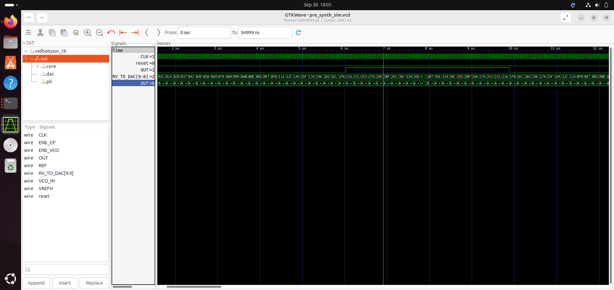

In this picture we can see the following signals:

**CLK**: This is the input CLK signal of the RVMYTH core. This signal comes from the PLL, originally.

**reset**: This is the input reset signal of the RVMYTH core. This signal comes from an external source, originally.

**OUT**: This is the output OUT signal of the VSDBabySoC module. This signal comes from the DAC (due to simulation restrictions it behaves like a digital signal which is incorrect), originally.

**RV_TO_DAC[9:0]**: This is the 10-bit output [9:0] OUT port of the RVMYTH core. This port comes from the RVMYTH register #17, originally.

**OUT**: This is a real datatype wire which can simulate analog values. It is the output wire real OUT signal of the DAC module. This signal comes from the DAC, originally. 

This can be viewed by changing the Data Format of the signal to Analog → Step

#### Viewing DAC output in analog mode

Drag and drop the CLK, reset, OUT (DAC) (as analog step), and RV TO DAC [9:0] signals to their respective locations in the simulation tool 


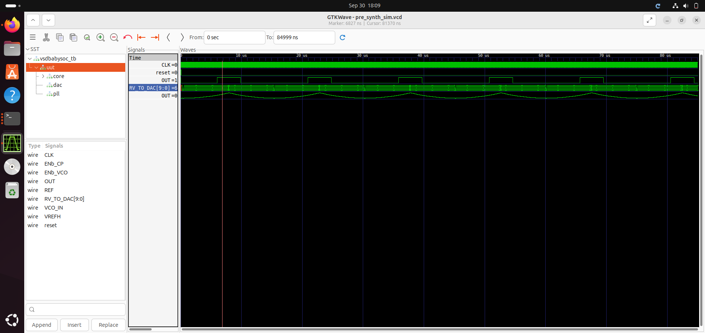


### Trouble shooting tips

   - Module Redefinition: If you encounter redefinition errors, ensure modules are included only once, either in the testbench or in the command line.
   - Path Issues: Verify paths specified with -I are correct. Use full paths if relative paths cause errors.

## Why Pre-Synthesis and Post-Synthesis?

1. **Pre-Synthesis Simulation**: 
   - Focuses only on verifying functionality based on the RTL code.
   - Zero-delay environment, with events occurring on the active clock edge.

2. **Post-Synthesis Simulation (GLS)**:
   - Uses the synthesized netlist (gate-level) to simulate both functionality and timing.
   - Identifies timing violations and potential mismatches (e.g., unintended latches).
   - Helps verify dynamic circuit behavior that static methods may miss.

---

#### <ins>Post-Synthesis Simulation</ins>

Post-synthesis simulation is a critical step in the digital design flow, providing insights into both the functionality and timing of the synthesized design. 

Unlike pre-synthesis simulation, which focuses solely on verifying the functionality based on the RTL code, post-synthesis simulation uses the synthesized netlist to ensure that the design behaves correctly in terms of both logic and timing.

Key aspects of post-synthesis simulation include:

**Functionality and Timing Verification**: It checks the design's functionality and timing using the gate-level netlist, helping identify timing violations and potential mismatches such as unintended latches.

**Dynamic Circuit Behavior**: Post-synthesis simulation can reveal dynamic circuit behaviors that static methods might miss, ensuring the design operates correctly under real-world conditions.

**Identifying Issues**: It helps in identifying issues that may not be apparent in pre-synthesis simulations, such as glitches or race conditions due to the actual gate delays.

The first step in the design flow is to synthesize the generated RTL code, followed by simulating the result. This process helps uncover more about the code and its potential bugs. In this section, we will synthesize our code and then perform a post-synthesis simulation to look for any issues. Ideally, the post-synthesis and pre-synthesis (modeling section) results should be identical, confirming that the synthesis process has not altered the original design behavior.

#### Why do pre-synthesis simulation? Why not just do post-synthesis simulation?
Pre-synthesis simulation is crucial for verifying the logical functionality of a digital design before it undergoes synthesis. It allows designers to detect and correct logical errors, such as incorrect operator usage or unintended latch inference, early in the development process. This type of simulation focuses solely on the high-level behavior of the design, enabling faster iterations and design exploration without the constraints of gate-level details. On the other hand, post-synthesis simulation, or gate-level simulation, is essential for timing verification and ensuring that the synthesized design meets real-world performance requirements. It accounts for gate delays and helps identify any synthesis-induced issues, providing a final validation of both functionality and timing before the design is implemented in hardware. Together, these simulations ensure a robust and reliable digital design.

Here is the step-by-step execution plan for running the  commands manually:
---
### **Step 1: Load the Top-Level Design and Supporting Modules**
- Launch the yosys synthesis tool from your working directory.
```bash
nagendrakudva123@nagendrakudva123-VirtualBox:~/VSDBabySoC$ yosys
```

 
- Read the main vsdbabysoc.v RTL file into the yosys environment.
```bash
yosys> read_verilog src/module/vsdbabysoc.v 
```
 

- The following cp commands copy essential header files from the src/include directory into the working directory. These include:

  **sp_verilog.vh** – contains Verilog definitions and macros

  **sandpiper.vh** – holds integration-related definitions for SandPiper

  **sandpiper_gen.vh** – may include auto-generated or tool-generated parameters

```bash
nagendrakudva123@nagendrakudva123-VirtualBox:~$ cd ~/VSDBabySoC
nagendrakudva123@nagendrakudva123-VirtualBox:~/VSDBabySoC$ cp -r src/include/sp_verilog.vh .
nagendrakudva123@nagendrakudva123-VirtualBox:~/VSDBabySoC$ cp -r src/include/sandpiper.vh .
nagendrakudva123@nagendrakudva123-VirtualBox:~/VSDBabySoC$ cp -r src/include/sandpiper_gen.vh .
nagendrakudva123@nagendrakudva123-VirtualBox:~/VSDBabySoC$ ls
images  LICENSE  Makefile  output  README.md  sandpiper_gen.vh  sandpiper.vh  sp_env  sp_verilog.vh  src
```

- Read the rvmyth.v file with the include path using -I option.
```bash
yosys> read_verilog -I ~/VSDBabySoC/src/include/ ~/VSDBabySoC/src/module/rvmyth.v
```


#### ❗Note:

_If you try to read the rvmyth.v file using yosys without copying the necessary header files first, you may encounter errors like:_

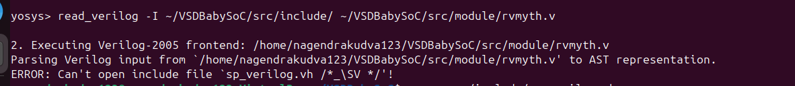


_To avoid these errors, make sure to copy the required include files into your working directory! This ensures Yosys can resolve them correctly during parsing, even if the -I option is used._

- Read the clk_gate.v file with the include path using -I option.
  
```bash
yosys> read_verilog -I ~/VSDBabySoC/src/include/ ~/VSDBabySoC/src/module/clk_gate.v
```


 ### **Step 2: Load the Liberty Files for Synthesis**
Inside the same yosys shell, run:
```bash
yosys> read_liberty -lib ~/VSDBabySoC/src/lib/avsdpll.lib 
yosys> read_liberty -lib ~/VSDBabySoC/src/lib/avsddac.lib 
yosys> read_liberty -lib ~/VSDBabySoC/src/lib/sky130_fd_sc_hd__tt_025C_1v80.lib
```
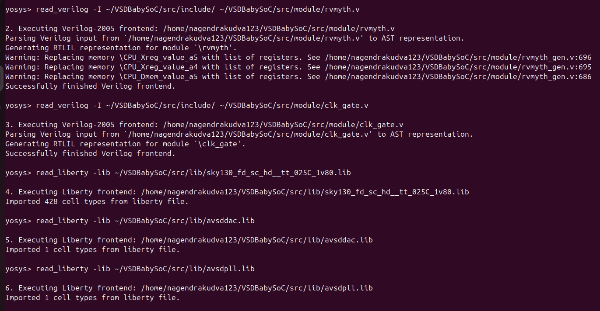

### **Step 3: Run Synthesis Targeting `vsdbabysoc`**
```bash
yosys> synth -top vsdbabysoc
```


### **Step 4: Map D Flip-Flops to Standard Cells**

```bash
yosys> dfflibmap -liberty ~/VSDBabySoC/src/lib/sky130_fd_sc_hd__tt_025C_1v80.lib
```
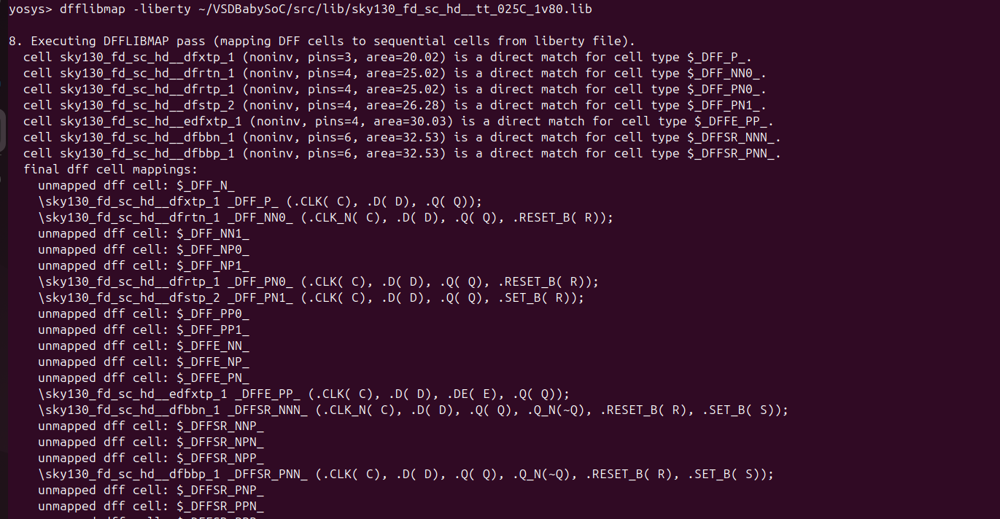

### **Step 5: Perform Optimization and Technology Mapping**
```bash
yosys> opt
yosys> abc -liberty ~/VSDBabySoC/src/lib/sky130_fd_sc_hd__tt_025C_1v80.lib -script +strash;scorr;ifraig;retime;{D};strash;dch,-f;map,-M,1,{D}
```

| Step           | Purpose                                                              |
| -------------- | -------------------------------------------------------------------- |
| `strash`       | Structural hashing (reduces logic redundancy)                        |
| `scorr`        | Sequential sweeping for redundancy removal                           |
| `ifraig`       | Incremental FRAIGing (logic equivalence checking and optimization)   |
| `retime;{D}`   | Move registers across combinational logic to optimize timing         |
| `strash`       | Re-run structural hashing after retiming                             |
| `dch,-f`       | Delay-aware combinational optimization with fast mode                |
| `map,-M,1,{D}` | Map logic to gates minimizing area (`-M,1`) and retime-aware (`{D}`) |


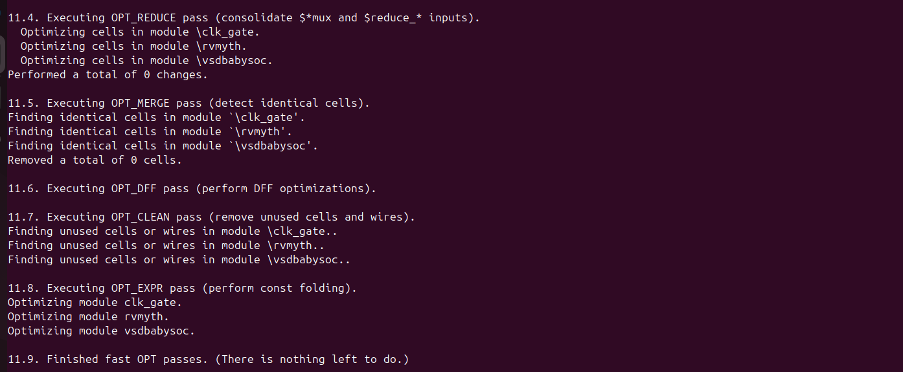


### **Step 6: Perform Final Clean-Up and Renaming**

```bash
yosys> flatten
yosys> setundef -zero
yosys> clean -purge
yosys> rename -enumerate
```
| **Command**         | **Purpose / Usage**                                                                    |
| ------------------- | -------------------------------------------------------------------------------------- |
| `flatten`           | Flattens the entire design hierarchy into a single-level netlist.                      |
| `setundef -zero`    | Replaces all undefined (`x`) logic values with logical `0` to avoid simulation issues. |
| `clean -purge`      | Removes all unused wires, cells, and modules; `-purge` makes it more aggressive.       |
| `rename -enumerate` | Renames internal wires and cells to unique, numbered names for consistency.            |


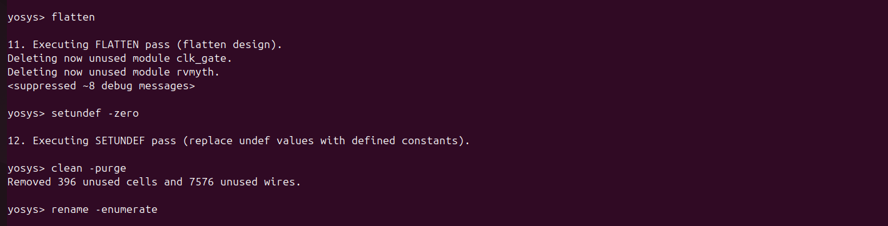


### **Step 7: Check Statistics**
```bash
yosys> show vsdbabyso
```

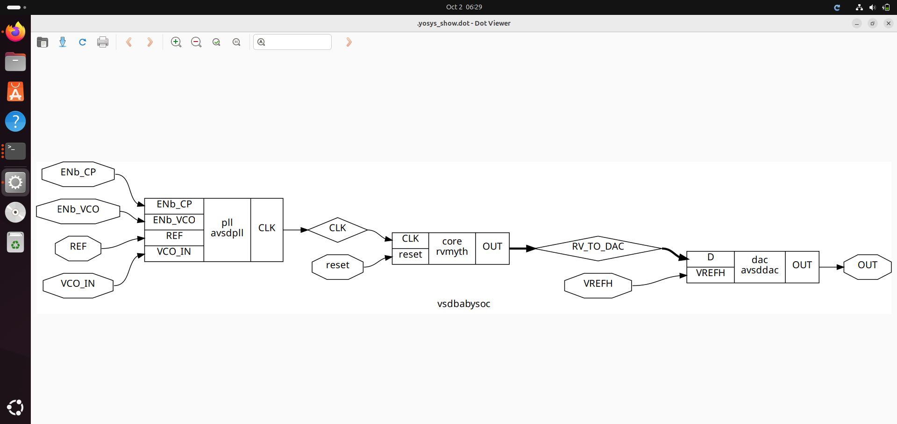


``` bash
yosys> show clk_gate
```

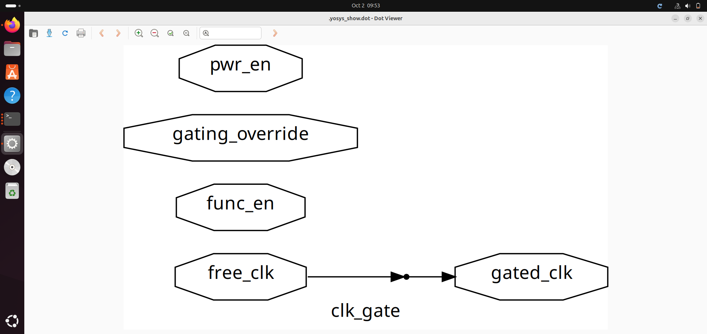


### **Step 8: Check Statistics**
```bash
yosys> stat
```

13. Printing statistics.
```shell
=== vsdbabysoc ===

   Number of wires:               4736
   Number of wire bits:           6210
   Number of public wires:        4736
   Number of public wire bits:    6210
   Number of ports:                  7
   Number of port bits:              7
   Number of memories:               0
   Number of memory bits:            0
   Number of processes:              0
   Number of cells:               5920
     $scopeinfo                      8
     avsddac                         1
     avsdpll                         1
     sky130_fd_sc_hd__a2111oi_0     10
     sky130_fd_sc_hd__a211o_2        1
     sky130_fd_sc_hd__a211oi_1      26
     sky130_fd_sc_hd__a21boi_0       4
     sky130_fd_sc_hd__a21o_2         1
     sky130_fd_sc_hd__a21oi_1      672
     sky130_fd_sc_hd__a221o_2        1
     sky130_fd_sc_hd__a221oi_1     163
     sky130_fd_sc_hd__a22o_2         4
     sky130_fd_sc_hd__a22oi_1      123
     sky130_fd_sc_hd__a311oi_1       4
     sky130_fd_sc_hd__a31o_2         1
     sky130_fd_sc_hd__a31oi_1      344
     sky130_fd_sc_hd__a32oi_1        2
     sky130_fd_sc_hd__a41oi_1       26
     sky130_fd_sc_hd__and2_2        12
     sky130_fd_sc_hd__and3_2         1
     sky130_fd_sc_hd__clkinv_1     597
     sky130_fd_sc_hd__dfxtp_1     1144
     sky130_fd_sc_hd__lpflow_inputiso0p_1      1
     sky130_fd_sc_hd__mux2i_1       12
     sky130_fd_sc_hd__nand2_1      839
     sky130_fd_sc_hd__nand3_1      249
     sky130_fd_sc_hd__nand3b_1       1
     sky130_fd_sc_hd__nand4_1       41
     sky130_fd_sc_hd__nor2_1       403
     sky130_fd_sc_hd__nor3_1        35
     sky130_fd_sc_hd__nor4_1         2
     sky130_fd_sc_hd__o2111ai_1     20
     sky130_fd_sc_hd__o211a_1        1
     sky130_fd_sc_hd__o211ai_1      49
     sky130_fd_sc_hd__o21a_1         6
     sky130_fd_sc_hd__o21ai_0      866
     sky130_fd_sc_hd__o21ba_2        1
     sky130_fd_sc_hd__o21bai_1      18
     sky130_fd_sc_hd__o221a_2        1
     sky130_fd_sc_hd__o221ai_1       7
     sky130_fd_sc_hd__o22ai_1      155
     sky130_fd_sc_hd__o2bb2ai_1      1
     sky130_fd_sc_hd__o311ai_0       2
     sky130_fd_sc_hd__o31ai_1        3
     sky130_fd_sc_hd__o32ai_1        1
     sky130_fd_sc_hd__o41ai_1        1
     sky130_fd_sc_hd__or2_2         12
     sky130_fd_sc_hd__or3_2          1
     sky130_fd_sc_hd__or4_2          1
     sky130_fd_sc_hd__xnor2_1       13
     sky130_fd_sc_hd__xor2_1        32
```

### **Step 9: Write the Synthesized Netlist**
```bash

yosys> write_verilog -noattr ~/VSDBabySoC/output/post_synth_sim/vsdbabysoc.synth.v
```


## POST_SYNTHESIS SIMULATION AND WAVEFORMS
---

### **Step 1: Compile the Testbench**

Before running the iverilog command, copy the necessary standard cell and primitive models:
These files must be present in the same directory as the testbench (src/module) to resolve all module references during compilation.

```bash
nagendrakudva123@nagendrakudva123-VirtualBox:~/VSDBabySoC/src/module$ cp -r ~/sky130RTLDesignAndSynthesisWorkshop/my_lib/verilog_model/sky130_fd_sc_hd.v .
nagendrakudva123@nagendrakudva123-VirtualBox:~/VSDBabySoC/src/module$ cp -r ~/sky130RTLDesignAndSynthesisWorkshop/my_lib/verilog_model/primitives.v .
```

To ensure that the synthesized Verilog file _(vsdbabysoc.synth.v)_ is available in the src/module directory for further processing or simulation, you can copy it from the output directory to the src/module directory. Here is the step to do that:
```bash
nagendrakudva123@nagendrakudva123-VirtualBox:~/VSDBabySoC$ cp -r ~/VSDBabySoC/output/post_synth_sim/vsdbabysoc.synth.v ~/VSDBabySoC/src/module/
```

Run the following `iverilog` command to compile the testbench:
```bash
nagendrakudva123@nagendrakudva123-VirtualBox:~/VSDBabySoC$ iverilog -o ~/VSDBabySoC/output/post_synth_sim/post_synth_sim.out -DPOST_SYNTH_SIM -DFUNCTIONAL -DUNIT_DELAY=#1 -I ~/VSDBabySoC/src/include -I ~/VSDBabySoC/src/module ~/VSDBabySoC/src/module/testbench.v
```
| **Option / Argument**                                                      | **Purpose / Description**                                                            |
| -------------------------------------------------------------------------- | ------------------------------------------------------------------------------------ |
| `iverilog`                                                                 | Icarus Verilog compiler used to compile Verilog files into a simulation executable.  |
| `-o ~/VSDBabySoC/output/post_synth_sim/post_synth_sim.out` | Specifies the output binary file for simulation.                                     |
| `-DPOST_SYNTH_SIM`                                                         | Defines the macro `POST_SYNTH_SIM` (used in testbench to switch simulation modes).   |
| `-DFUNCTIONAL`                                                             | Defines `FUNCTIONAL` to use behavioral models instead of detailed gate-level timing. |
| `-DUNIT_DELAY=#1`                                                          | Assigns a unit delay of `#1` to all gates for post-synthesis simulation.             |
| `-I ~/VSDBabySoC/src/include`                              | Adds the `include` directory to the search path for `\`include\` directives.         |
| `-I ~/VSDBabySoC/src/module`                               | Adds the `module` directory to the include path for additional module references.    |
| `~/VSDBabySoC/src/module/testbench.v`                      | Specifies the testbench file as the top-level design for simulation.                 |

#### ❗Note - You may encounter this error:
```bash
nagendrakudva123@nagendrakudva123-VirtualBox:~/VSDBabySoC$ iverilog -o ~/VSDBabySoC/output/post_synth_sim/post_synth_sim.out -DPOST_SYNTH_SIM -DFUNCTIONAL -DUNIT_DELAY=#1 -I ~/VSDBabySoC/src/include -I ~/VSDBabySoC/src/module ~/VSDBabySoC/src/module/testbench.v
~/VSDBabySoC/src/module/sky130_fd_sc_hd.v:74452: syntax error
I give up.
```
_To resolve this : Update the syntax in the file sky130_fd_sc_hd.v at or around line 74452._

###### Change:
```bash
`endif SKY130_FD_SC_HD__LPFLOW_BLEEDER_FUNCTIONAL_V
```
###### To:
```bash
`endif // SKY130_FD_SC_HD__LPFLOW_BLEEDER_FUNCTIONAL_V
```


---
### **Step 2: Navigate to the Post-Synthesis Simulation Output Directory**
```bash
cd output/post_synth_sim/
```
---
### **Step 3: Run the Simulation**

```bash
./post_synth_sim.out
```
---
### **Step 4: View the Waveforms in GTKWave**

```bash
gtkwave post_synth_sim.vcd
```
---
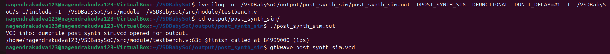


## Comparing Pre-Synthesis and Post-Synthesis Output

To ensure that the synthesis process did not alter the original design behavior, the output from the pre-synthesis simulation was compared with the post-synthesis simulation.

Both simulations were run using GTKWave, and the resulting waveforms were observed.


✅ _The outputs match exactly, confirming that the functionality is preserved across the synthesis flow._

_This validates that the synthesized netlist is functionally equivalent to the RTL 
